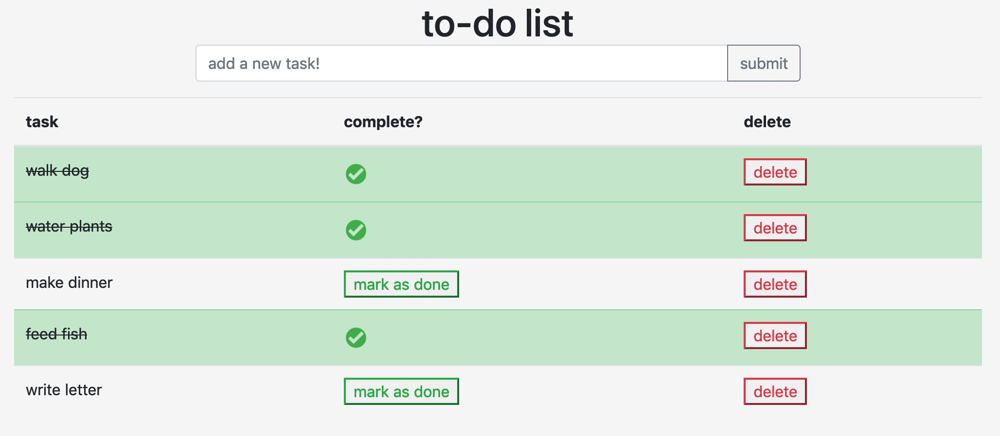

# To-Do List

## Description
This application serves as a simple to-do list. Users can add tasks with the text box at the top. The list of tasks appears below, with buttons to complete and delete tasks. Completed tasks turn green. 

## Install and Run
To use this app, clone the repository and run `npm install`.
Then, run `npm start` in the terminal, and navigate to `http://localhost:5000/`.

